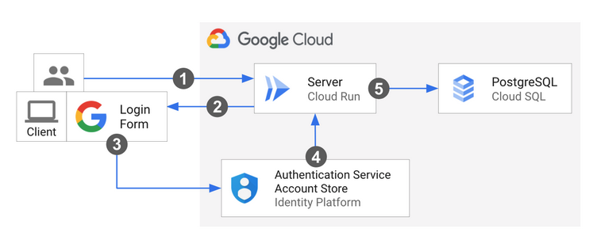

# cloudrun auth tutorial

cloud runでの認証のチュートリアル

## tutorial

[tutorial][tutorial]実行中。

[2023-09-28 06:43:18]

- プロジェクト作成: cloudrun-auth-tutorial
- APIを有効化
- .envrcを用意
- ソースレポジトリをsubmodule add
- アーキテクチャ



**サンプルソース読み込み: クライアント側**

python-docs-samples/run/idp-sql以下にある

- クライアント側の起動方法は、READMEに記載
- static/config.jsでkeyなどの情報を追加
- templates/index.htmlにviewのコード
- staic/firebase.jsでクライアント側の認証動作
  - firebase sdkを利用

```javascript
function signIn() {
  //Googleアカウントを利用
  const provider = new firebase.auth.GoogleAuthProvider();
  provider.addScope('https://www.googleapis.com/auth/userinfo.email');
  firebase
    .auth()
    .signInWithPopup(provider)
    .then(result => {
      // Returns the signed in user along with the provider's credential
      console.log(`${result.user.displayName} logged in.`);
      window.alert(`Welcome ${result.user.displayName}!`);
    })
    .catch(err => {
      console.log(`Error during sign in: ${err.message}`);
      window.alert('Sign in failed. Retry or check your browser logs.');
    });
}
```

上のコードで、別画面での認証が走る。これを使って認証済みであれば、

```javascript
if(firebase.auth().currentUser) { ... }
```

のような感じで認証状態をチェックできる。また、サーバーにリクエストを送る際に、

```javascript
{
  headers: {
    Authorization: `Bearer ${token}`,
  }
}
```

というヘッダを付けることで、サーバー側で認証が可能になる。

**サンプルソース読み込み: サーバー側**

```python
    header = request.headers.get("Authorization", None)
    if header:
        token = header.split(" ")[1]
        try:
            decoded_token = firebase_admin.auth.verify_id_token(token)
        except Exception as e:
            logger.exception(e)
            return Response(status=403, response=f"Error with authentication: {e}")
    else:
        return Response(status=401)
```

上のように、ヘッダーからAuthorizationを読み、`firebase_admin`を使って、こいつをチェックする。
Authorizationヘッダの中には、JWTで情報が書かれているので、

- 形式が正しいか
- 期限切れでないか
- 署名が正しいか

を検証する。JWTに関する情報: [link][jwt]

**※ cloud sqlへの接続とsecret managerの部分は飛ばした**

けど、secret managerの部分は読んどいた方が良さそう

**identity platformの設定**

- APIの有効化
- OAuth同意画面の作成
  - APIとサービス→認証情報→同意画面を構成
  - ロゴを登録するとgoogleの検証が必要らしい
- OAuthクライアントIDとシークレットの作成
  - APIとサービス→認証情報→認証情報を作成
- プロバイダの設定
  - [Identity Platform][provider]の下に設定ページがある
  - プロバイダを追加→Googleを選択
  - client idとclient secretを登録
  - api keyとauth domainを取得→クライアント用コードにコピペ

**OAuthの用語の復習**

- オーナー: アプリのユーザーのこと. データのオーナーなので「オーナー」
- プロバイダ: データを管理し、アプリにデータを提供している主体。今の場合、Google
- クライアント: 我々が作っているアプリ

**デプロイ**

Cloud SQLインスタンスの起動

```shell
gcloud sql instances create predapi \
    --database-version=POSTGRES_12 \
    --region=asia-northeast1 \
    --cpu=2 \
    --memory=7680MB \
    --root-password=$(cat db_password)
```

認証情報を`python-docs-samples/run/idp-sql/postgres-secrets.json`に記載

シークレットの作成

```shell
gcloud secrets create idp-sql-secrets \
    --replication-policy="automatic" \
    --data-file=postgres-secrets.json
```

サービスアカウントの作成

```shell
gcloud iam service-accounts create idp-sql-identity
```

サービスアカウントに、シークレットへのアクセスを許可

```shell
gcloud secrets add-iam-policy-binding idp-sql-secrets \
  --member serviceAccount:idp-sql-identity@cloudrun-auth-tutorial.iam.gserviceaccount.com \
  --role roles/secretmanager.secretAccessor
```

サービスアカウントに、Cloud SQLへのアクセスを許可

```shell
gcloud projects add-iam-policy-binding cloudrun-auth-tutorial \
  --member serviceAccount:idp-sql-identity@cloudrun-auth-tutorial.iam.gserviceaccount.com \
  --role roles/cloudsql.client
```

イメージのビルド

```shell
gcloud builds submit --tag gcr.io/cloudrun-auth-tutorial/idp-sql
```

cloud runのデプロイ

```shell
gcloud run deploy idp-sql \
    --image gcr.io/cloudrun-auth-tutorial/idp-sql \
    --allow-unauthenticated \
    --service-account idp-sql-identity@cloudrun-auth-tutorial.iam.gserviceaccount.com \
    --add-cloudsql-instances cloudrun-auth-tutorial:asia-northeast1:predapi \
    --update-secrets CLOUD_SQL_CREDENTIALS_SECRET=idp-sql-secrets:latest
```

- 未認証のアクセスを許可している(`--allow-unauthenticated`)
- サービスアカウントを指定している(`--service-account`)
- Cloud SQLのインスタンスを指定している(`--add-cloudsql-instances`)
- シークレットを環境変数に入れている(`--update-secrets`)
  - 例では`latest`を指定しているが、本当は特定のバージョンを指定した方が良いらしい
    - 「環境変数はインスタンスの起動時に解決されるため」とのこと
    - そのインスタンスが使っているシークレットが、どのバージョンか分からなくなるから・・かな

Identity Platformにリダイレクト先の登録

- Identity Platform → IDプロバイダ → 「Google」の編集ボタン → リダイレクト先の登録ペインがある
- ここに、Cloud Runのドメインを登録
- これは、プロバイダの許可画面からリダイレクトする先 = クライアントのwebサーバー = cloud runのurl
  - cloud runのurlは、デプロイ時に画面に表示される

OAuthクライアントにリダイレクト先の登録

- APIとサービス → 認証情報 → OAuthクライアントの編集ボタン
- ここに、`https://cloudrun-auth-tutorial.firebaseapp.com/__/auth/handler`を登録
- これは、webサーバー(cloud run)から、認証フローを開始するために遷移するurl = firebaseのどっか(実際は、SDKが面倒見てくれるので自分ではコード書かない部分)

ここまでで作業は完了・・なんだけど、実際には起動に失敗した。[2023-10-05]現在。
[このissue][issue]参照。

解決策としては、`python-docs-samples/run/idp-sql/requirements.txt`に`Werkzeug==2.2.2`を追加すれば良い。

<!-- link -->
[tutorial]: https://cloud.google.com/run/docs/tutorials/identity-platform
[jwt]: https://developer.mamezou-tech.com/blogs/2022/12/08/jwt-auth/
[provider]: https://console.cloud.google.com/customer-identity/providers?project=_&hl=ja
[issue]: https://github.com/GoogleCloudPlatform/python-docs-samples/issues/10732
